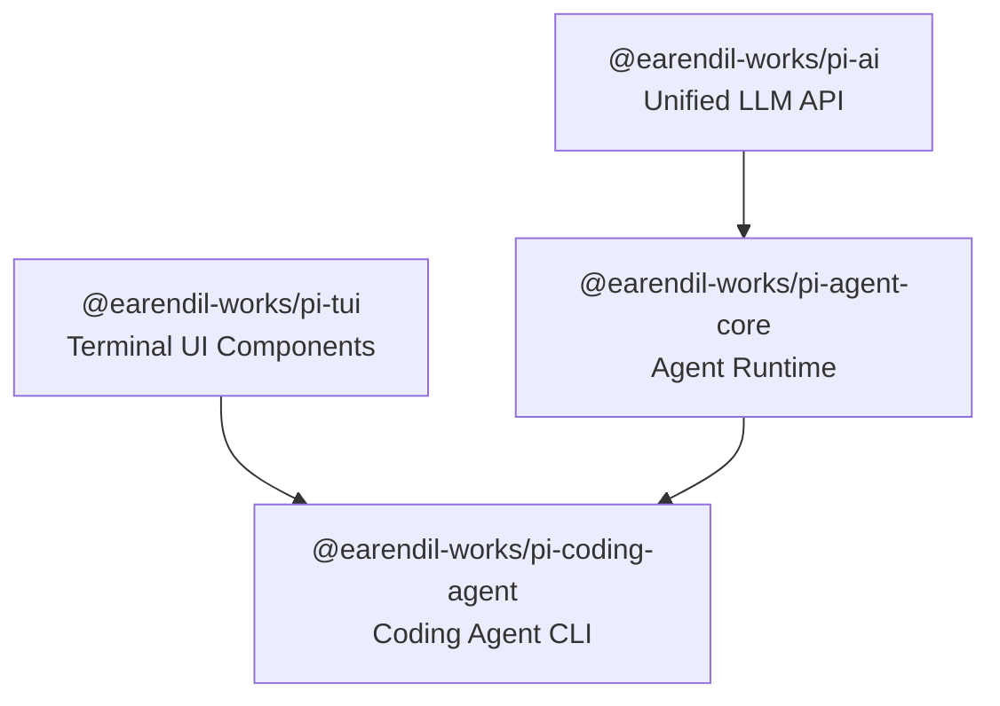

<p align="center">
  <a href="https://pi.dev">
    
  </a>
</p>

<p align="center">
  <a href="https://www.npmjs.com/package/@earendil-works/pi-coding-agent"></a>
  <a href="https://github.com/earendil-works/pi/actions/workflows/ci.yml"></a>
  <a href="https://github.com/earendil-works/pi/blob/main/LICENSE"></a>
  <a href="https://discord.com/invite/3cU7Bz4UPx"></a>
</p>

<p align="center">
  <a href="https://github.com/earendil-works/pi/releases"></a>
  <a href="https://github.com/earendil-works/pi/releases"></a>
  <a href="https://github.com/earendil-works/pi/releases"></a>
</p>

<p align="center">
  <a href="https://pi.dev">pi.dev</a> domain graciously donated by
  <br>
  <a href="https://exe.dev"><br>exe.dev</a>
</p>

> New issues and PRs from new contributors are auto-closed by default. Maintainers review auto-closed issues daily. See [CONTRIBUTING.md](../../CONTRIBUTING.md).

---

Pi is a minimal terminal coding harness. Adapt pi to your workflows, not the other way around, without having to fork and modify pi internals.

It gives LLMs four built-in tools (`read`, `write`, `edit`, `bash`), connects to 30+ LLM providers, and runs in four modes (interactive TUI, print, JSON events, RPC). Extend it with TypeScript extensions, skills, prompt templates, and themes. Bundle and share them as pi packages via npm or git.

Pi ships with powerful defaults but intentionally leaves out sub-agents, plan mode, and MCP. Instead, you build what you need with extensions, skills, or third-party packages.

## Share Your OSS Coding Agent Sessions

If you use pi for open source work, please share your sessions using [`badlogic/pi-share-hf`](https://github.com/badlogic/pi-share-hf). Public OSS session data helps improve models, prompts, tools, and evaluations with real-world workflows instead of toy benchmarks.

[Explanation on X](https://x.com/badlogicgames/status/2037811643774652911) | [pi-mono sessions on HF](https://huggingface.co/datasets/badlogicgames/pi-mono)

---

## Quick Start

**1. Install**

```bash
npm install -g --ignore-scripts @earendil-works/pi-coding-agent
```

`--ignore-scripts` disables dependency lifecycle scripts during install. Pi does not require install scripts for normal npm installs.

Linux/macOS alternative:

```bash
curl -fsSL https://pi.dev/install.sh | sh
```

**2. Verify**

```bash
pi --version
```

**3. Authenticate**

API key:

```bash
export ANTHROPIC_API_KEY=sk-ant-...
```

Or subscription login (run pi, then `/login`):

```bash
pi
/login
```

**4. Run**

```bash
cd /path/to/project
pi "Summarize this repository and tell me how to run its checks."
```

By default, pi gives the model four tools: `read`, `write`, `edit`, and `bash`. The model uses these to fulfill your requests.

| Platform | Docs |
|----------|------|
| Windows | [docs/windows.md](docs/windows.md) |
| Termux (Android) | [docs/termux.md](docs/termux.md) |
| tmux | [docs/tmux.md](docs/tmux.md) |
| Terminal setup | [docs/terminal-setup.md](docs/terminal-setup.md) |
| Shell aliases | [docs/shell-aliases.md](docs/shell-aliases.md) |

---

## Key Features

| | Feature | Description |
|---|---|---|
| :electric_plug: | Extensible Core | TypeScript extensions, skills, prompt templates, themes, pi packages |
| :globe_with_meridians: | 30+ LLM Providers | Anthropic, OpenAI, Google, Bedrock, Mistral, Groq, GitHub Copilot, xAI, and more |
| :computer: | 4 Run Modes | Interactive TUI, print (`-p`), JSON events (`--mode json`), RPC (`--mode rpc`) |
| :twisted_rightwards_arrows: | Session Management | JSONL persistence, branching, forking, cloning, compaction, tree navigation |
| :art: | Customizable TUI | Themes (hot-reloadable), inline images, custom editors, widgets, footers |
| :lock: | Project Trust | Explicit gate for project-local instructions, settings, and extensions |

---

## Architecture

Pi is the top-level package in the pi-monorepo. It depends on three sibling packages:

| Layer | Package | Role |
|-------|---------|------|
| CLI | `@earendil-works/pi-coding-agent` | Main product: coding agent CLI with tools, sessions, extensions |
| Agent | `@earendil-works/pi-agent-core` | Agent loop, tool execution, event streaming, steering/follow-up queues |
| AI | `@earendil-works/pi-ai` | Unified multi-provider LLM API, model registry, image generation, OAuth |
| TUI | `@earendil-works/pi-tui` | Terminal UI with differential rendering, synchronized output, components |



**Tech stack**: Node.js 22.19+ (Bun binary distribution for 6 platforms), TypeScript strict, `tsgo` compiler (`@typescript/native-preview`), Biome 2.3.5 linting/formatting, Vitest 3.2.4 testing.

---

## Interactive Mode

<p align="center"></p>

The interface from top to bottom:

- **Startup header** — shortcuts, loaded AGENTS.md files, prompt templates, skills, extensions
- **Messages** — user prompts, assistant responses, tool calls and results, notifications, extension UI
- **Editor** — where you type; border color indicates thinking level
- **Footer** — working directory, session name, token/cache usage, cost, context %, current model

### Editor

| Feature | How |
|---------|------|
| File reference | Type `@` to fuzzy-search project files |
| Path completion | Tab |
| Multi-line | Shift+Enter |
| Images | Ctrl+V (Alt+V on Windows), or drag onto terminal |
| Bash commands | `!command` runs and sends output to LLM; `!!command` runs without sending |

### Slash Commands

| Command | Description |
|---------|-------------|
| `/login`, `/logout` | OAuth authentication |
| `/model` | Switch models |
| `/scoped-models` | Enable/disable models for Ctrl+P cycling |
| `/settings` | Thinking level, theme, message delivery, transport |
| `/resume` | Pick from previous sessions |
| `/new` | Start a new session |
| `/session` | Show session info |
| `/tree` | Jump to any point in the session tree |
| `/trust` | Save project trust decision |
| `/fork` | Create a new session from a previous user message |
| `/clone` | Duplicate current active branch into a new session |
| `/compact [prompt]` | Manually compact context |
| `/export [file]` | Export session to HTML |
| `/share` | Upload as private GitHub gist |
| `/reload` | Reload keybindings, extensions, skills, prompts, context files |
| `/hotkeys` | Show all keyboard shortcuts |
| `/quit` | Quit pi |

### Keyboard Shortcuts

| Key | Action |
|-----|--------|
| Ctrl+C | Clear editor |
| Ctrl+C twice | Quit |
| Escape | Cancel/abort |
| Escape twice | Open `/tree` |
| Ctrl+L | Open model selector |
| Ctrl+P / Shift+Ctrl+P | Cycle scoped models |
| Shift+Tab | Cycle thinking level |
| Ctrl+O | Collapse/expand tool output |
| Ctrl+T | Collapse/expand thinking blocks |

### Message Queue

Submit messages while the agent is working:

- **Enter** queues a *steering* message (delivered after current tool calls finish)
- **Alt+Enter** queues a *follow-up* message (delivered after agent finishes all work)
- **Escape** aborts and restores queued messages to editor

See [docs/settings.md](docs/settings.md) for delivery mode configuration.

---

## Sessions

Sessions auto-save to `~/.pi/agent/sessions/` as JSONL files with a tree structure. Each entry has an `id` and `parentId`, enabling in-place branching.

```bash
pi -c                  # Continue most recent session
pi -r                  # Browse and select from past sessions
pi --name "my task"    # Set session display name at startup
pi --session <path|id> # Use specific session file
pi --fork <path|id>    # Fork a session into a new file
pi --no-session        # Ephemeral mode (don't save)
```

### Branching

**`/tree`** — Navigate the session tree in-place. Select any previous point, continue from there, switch between branches. All history preserved in a single file.

<p align="center"></p>

- Search by typing, fold/unfold and jump between branches
- Filter modes: default, no-tools, user-only, labeled-only, all
- Shift+L to label entries as bookmarks

**`/fork`** — Create a new session file from a previous user message on the active branch.

**`/clone`** — Duplicate the current active branch into a new session file.

### Compaction

Long sessions can exhaust context windows. Compaction summarizes older messages while keeping recent ones. Automatic by default (triggers on overflow or proactively near the limit). Manual via `/compact` or `/compact <custom instructions>`.

Compaction is lossy. The full history remains in the JSONL file; use `/tree` to revisit.

See [docs/sessions.md](docs/sessions.md), [docs/session-format.md](docs/session-format.md), and [docs/compaction.md](docs/compaction.md).

---

## Providers & Models

For each built-in provider, pi maintains a list of tool-capable models, updated with every release.

**Subscriptions** (via `/login`):
- Anthropic Claude Pro/Max
- OpenAI ChatGPT Plus/Pro (Codex)
- GitHub Copilot

**API keys** (via env var or `/login`):
- Anthropic, OpenAI, Azure OpenAI, DeepSeek, NVIDIA NIM
- Google Gemini, Google Vertex, Amazon Bedrock
- Mistral, Groq, Cerebras, xAI
- OpenRouter, Vercel AI Gateway
- Cloudflare (Workers AI, AI Gateway)
- Fireworks, Together AI, Hugging Face
- ZAI, ZAI Coding Plan (China)
- OpenCode Zen, OpenCode Go
- Kimi For Coding, MiniMax
- Xiaomi MiMo (API billing + Token Plans for cn/ams/sgp)
- Ant Ling

See [docs/providers.md](docs/providers.md) for detailed setup.

**Custom models and providers**: Add models via `~/.pi/agent/models.json` for APIs compatible with OpenAI, Anthropic, or Google. For custom APIs or OAuth, use extensions. See [docs/models.md](docs/models.md) and [docs/custom-provider.md](docs/custom-provider.md).

---

## Customization

| System | Where | Format |
|--------|-------|--------|
| Extensions | `.pi/extensions/`, `~/.pi/agent/extensions/`, builtin/ | TypeScript, event-driven lifecycle hooks |
| Skills | `.pi/skills/`, `~/.pi/agent/skills/`, `~/.agents/skills/` | SKILL.md + YAML frontmatter |
| Prompt Templates | `.pi/prompts/`, `~/.pi/agent/prompts/` | Markdown + bash-style argument substitution |
| Themes | `.pi/themes/`, `~/.pi/agent/themes/` | JSON (hot-reloadable on modify) |
| Pi Packages | npm or git (via `pi install`) | Bundle extensions, skills, prompts, themes |

### Extensions

TypeScript modules that extend pi with custom tools, commands, keyboard shortcuts, event handlers, UI components, and provider integrations.

```typescript
export default function (pi: ExtensionAPI) {
  pi.registerTool({ name: "deploy", description: "Deploy to production", parameters: Type.Object({...}) });
  pi.registerCommand("stats", { description: "Show stats", handler: async (args, ctx) => { ... } });
  pi.on("tool_call", async (event, ctx) => { ... });
  pi.registerProvider("my-proxy", { baseUrl: "...", api: "anthropic-messages", models: [...] });
}
```

**What's possible**: custom tools, sub-agents, plan mode, custom compaction, permission gates, custom editors/headers/footers, git checkpointing, MCP server integration, sandbox execution.

76 example extensions in [examples/extensions/](examples/extensions/). See [docs/extensions.md](docs/extensions.md).

### Skills

On-demand capability packages following the [Agent Skills standard](https://agentskills.io). Invoke via `/skill:name` or let the model load them automatically.

```markdown
---
name: code-review
description: Review code for bugs and security issues
---

1. Read the files mentioned by the user
2. Check for common vulnerabilities
3. Summarize findings
```

See [docs/skills.md](docs/skills.md).

### Prompt Templates

Reusable prompts as Markdown files. Type `/name` to expand.

```markdown
---
description: Review code focusing on a specific area
argument-hint: focus area
---

Review this code for {{$1}} issues.
```

See [docs/prompt-templates.md](docs/prompt-templates.md).

### Themes

Built-in: `dark`, `light`. Themes hot-reload: modify the active file and pi immediately applies the changes. See [docs/themes.md](docs/themes.md).

### Pi Packages

Bundle and share extensions, skills, prompts, and themes via npm or git.

```bash
pi install npm:@foo/pi-tools            # npm package
pi install npm:@foo/pi-tools@1.2.3      # pinned version
pi install git:github.com/user/repo     # git repository
pi install git:github.com/user/repo@v1  # pinned tag/commit
pi install -l npm:@foo/pi-tools         # project-local (.pi/npm/)
pi remove npm:@foo/pi-tools
pi list
pi update                               # update pi and packages
pi update --self                        # update pi only
pi config                               # enable/disable package resources
```

> **Security**: Pi packages run with full system access. Review source before installing third-party packages.

Create a package by adding a `pi` key to `package.json`. Without a manifest, pi auto-discovers from conventional directories. See [docs/packages.md](docs/packages.md).

---

## Settings

| Location | Scope |
|----------|-------|
| `~/.pi/agent/settings.json` | Global (all projects) |
| `.pi/settings.json` | Project (overrides global) |

Use `/settings` to modify common options interactively. See [docs/settings.md](docs/settings.md) for all options.

**Project Trust**: On interactive startup, pi asks before trusting a project folder that contains project-local inputs. Trusting allows pi to read `AGENTS.md`/`CLAUDE.md`, load `.pi/settings.json` and `.pi` resources, install project packages, and execute project extensions. Use `/trust` to save a decision, `--approve`/`-a` per run, or `--no-approve`/`-na` to ignore project-local inputs.

**Telemetry**: Two separate features:
- **Update check** — fetches `pi.dev/api/latest-version`. Disable with `PI_SKIP_VERSION_CHECK=1`.
- **Install/update telemetry** — anonymous version ping on first install or update. Also controls optional provider attribution headers. Opt out via `enableInstallTelemetry: false` in settings or `PI_TELEMETRY=0`.

Use `--offline` or `PI_OFFLINE=1` to disable all startup network operations.

---

## Context Files

Pi loads `AGENTS.md` (or `CLAUDE.md`) at startup from:
- `~/.pi/agent/AGENTS.md` (global)
- Current directory and parent directories (only when the project is trusted)

Use for project instructions, conventions, and common commands. All matching files are concatenated.

Replace the default system prompt with `.pi/SYSTEM.md` or `~/.pi/agent/SYSTEM.md`. Append without replacing via `APPEND_SYSTEM.md`.

Disable with `--no-context-files` / `-nc`.

---

## Programmatic Usage

### SDK

```typescript
import { AuthStorage, createAgentSession, ModelRegistry, SessionManager } from "@earendil-works/pi-coding-agent";

const authStorage = AuthStorage.create();
const modelRegistry = ModelRegistry.create(authStorage);
const { session } = await createAgentSession({
  sessionManager: SessionManager.inMemory(),
  authStorage,
  modelRegistry,
});

await session.prompt("What files are in the current directory?");
```

For advanced multi-session runtime, use `createAgentSessionRuntime()` and `AgentSessionRuntime`. See [docs/sdk.md](docs/sdk.md) and [examples/sdk/](examples/sdk/).

### RPC Mode

For non-Node.js integrations:

```bash
pi --mode rpc
```

Strict LF-delimited JSONL over stdin/stdout. See [docs/rpc.md](docs/rpc.md) and [docs/json.md](docs/json.md).

---

## CLI Reference

```bash
pi [options] [@files...] [messages...]
```

### Modes

| Flag | Description |
|------|-------------|
| (no flag) | Interactive mode |
| `-p`, `--print` | Print response and exit |
| `--mode json` | Output all events as JSON lines |
| `--mode rpc` | RPC mode for process integration |
| `--export <in> [out]` | Export session to HTML |

### Model Options

| Option | Description |
|--------|-------------|
| `--provider <name>` | Provider (anthropic, openai, google, ...) |
| `--model <pattern>` | Model pattern or ID (supports `provider/id` and `:<thinking>`) |
| `--api-key <key>` | API key (overrides env vars) |
| `--thinking <level>` | off, minimal, low, medium, high, xhigh |
| `--models <patterns>` | Comma-separated patterns for Ctrl+P cycling |
| `--list-models [search]` | List available models |

### Session Options

| Option | Description |
|--------|-------------|
| `-c`, `--continue` | Continue most recent session |
| `-r`, `--resume` | Browse and select session |
| `--session <path\|id>` | Use specific session file or partial UUID |
| `--fork <path\|id>` | Fork a session into a new session |
| `--session-dir <dir>` | Custom session storage directory |
| `--no-session` | Ephemeral mode (don't save) |
| `--name <name>`, `-n <name>` | Set session display name |

### Tool Options

| Option | Description |
|--------|-------------|
| `--tools <list>`, `-t <list>` | Allowlist specific tool names |
| `--exclude-tools <list>`, `-xt <list>` | Disable specific tool names |
| `--no-builtin-tools`, `-nbt` | Disable built-in tools, keep extension tools |
| `--no-tools`, `-nt` | Disable all tools |

Available built-in tools: `read`, `bash`, `edit`, `write`, `grep`, `find`, `ls`

### Resource Options

| Option | Description |
|--------|-------------|
| `-e`, `--extension <source>` | Load extension (repeatable) |
| `--no-extensions` | Disable extension discovery |
| `--skill <path>` | Load skill (repeatable) |
| `--no-skills` | Disable skill discovery |
| `--prompt-template <path>` | Load prompt template (repeatable) |
| `--no-prompt-templates` | Disable prompt template discovery |
| `--theme <path>` | Load theme (repeatable) |
| `--no-themes` | Disable theme discovery |
| `--no-context-files`, `-nc` | Disable AGENTS.md/CLAUDE.md discovery |

### Other Options

| Option | Description |
|--------|-------------|
| `--system-prompt <text>` | Replace default system prompt |
| `--append-system-prompt <text>` | Append to system prompt |
| `--verbose` | Force verbose startup |
| `-a`, `--approve` | Trust project-local files for this run |
| `-na`, `--no-approve` | Ignore project-local files for this run |
| `-h`, `--help` | Show help |
| `-v`, `--version` | Show version |

### Package Commands

```bash
pi install <source> [-l]   # Install package (-l for project-local)
pi remove <source>         # Remove package
pi uninstall <source>      # Alias for remove
pi list                    # List installed packages
pi update                  # Update pi and packages
pi update --self           # Update pi only
pi update --self --force   # Reinstall even if current
pi config                  # Enable/disable package resources
```

### Examples

```bash
# Interactive with initial prompt
pi "List all .ts files in src/"

# Non-interactive
pi -p "Summarize this codebase"

# With piped stdin
cat README.md | pi -p "Summarize this text"

# Named one-shot session
pi --name "release audit" -p "Audit this repository"

# Specific model
pi --model openai/gpt-4o "Help me refactor"

# Model with thinking level shorthand
pi --model sonnet:high "Solve this complex problem"

# Read-only mode
pi --tools read,grep,find,ls -p "Review the code"

# Disable a specific tool
pi --exclude-tools ask_question

# Reference files with @ prefix
pi @src/main.ts @src/main.test.ts "Review these together"
```

### Environment Variables

| Variable | Description |
|----------|-------------|
| `PI_CODING_AGENT_DIR` | Override config directory (default: `~/.pi/agent`) |
| `PI_CODING_AGENT_SESSION_DIR` | Override session storage directory |
| `PI_PACKAGE_DIR` | Override package directory (Nix/Guix) |
| `PI_OFFLINE` | Disable all startup network operations |
| `PI_SKIP_VERSION_CHECK` | Skip version update check |
| `PI_TELEMETRY` | Override install telemetry (`0`/`false` to disable) |
| `PI_CACHE_RETENTION` | Set to `long` for extended prompt cache |
| `VISUAL`, `EDITOR` | External editor for Ctrl+G |
| `ANTHROPIC_API_KEY` | Anthropic API key |
| `OPENAI_API_KEY` | OpenAI API key |
| `GEMINI_API_KEY` | Google Gemini API key |
| `DEEPSEEK_API_KEY` | DeepSeek API key |
| (and 20+ more provider keys) | See [docs/providers.md](docs/providers.md) |

---

## Philosophy

Pi is aggressively extensible so it doesn't have to dictate your workflow. Features that other tools bake in can be built with extensions, skills, or installed from third-party pi packages. This keeps the core minimal while letting you shape pi to fit how you work.

- **No MCP** — build CLI tools with READMEs or an extension that adds MCP support. [Why?](https://mariozechner.at/posts/2025-11-02-what-if-you-dont-need-mcp/)
- **No sub-agents** — spawn pi instances via tmux, or build your own with extensions
- **No permission popups** — run in a container, or build your own confirmation flow with extensions
- **No plan mode** — write plans to files, or build it with extensions
- **No built-in to-dos** — they confuse models. Use a TODO.md file, or build your own
- **No background bash** — use tmux. Full observability, direct interaction

Read the [blog post](https://mariozechner.at/posts/2025-11-30-pi-coding-agent/) for the full rationale.

---

## Testing

```bash
npm test                              # Run all tests (vitest --run)
node ../../node_modules/vitest/dist/cli.js --run test/specific.test.ts   # Single test
```

Suite tests use `test/suite/harness.ts` with `FauxProvider` from `@earendil-works/pi-ai` — no real API keys needed. Regression tests go in `test/suite/regressions/<issue-number>-<short-slug>.test.ts`.

**Warning**: Never run `vitest --run` from the monorepo root. It includes e2e tests that activate when endpoint/auth env vars are present. Use `./test.sh` from the root instead.

Full quality pipeline (`npm run check` from repo root):
1. Biome lint + format
2. Pinned deps check
3. TypeScript import extension check
4. Shrinkwrap verification
5. `tsgo --noEmit` type check
6. Browser smoke test

See [docs/development.md](docs/development.md) for detailed development setup.

---

## Supply Chain Hardening

Pi treats npm dependency changes as reviewed code changes:

- Direct external dependencies are pinned to exact versions
- `npm ci --ignore-scripts` for installs — no lifecycle scripts run
- Pre-commit blocks lockfile commits unless `PI_ALLOW_LOCKFILE_CHANGE=1`
- Published CLI includes `npm-shrinkwrap.json` pinning transitive deps
- Scheduled GitHub workflow runs `npm audit --omit=dev` and signature verification
- New deps with lifecycle scripts require explicit allowlist review

---

## What's New

**v0.78.1** -- Project trust gating for local settings, resources, and instructions. Prompt cache hit rate in interactive footer. Ant Ling and NVIDIA NIM provider support. MiniMax-M3 models.

**v0.78.0** -- Named startup sessions (`--name` / `-n`). `--exclude-tools` / `-xt` to disable specific tools. Clickable OSC 8 file hyperlinks in built-in file tool titles. OpenAI Codex device-code login.

**v0.77.0** -- Claude Opus 4.8 support. Streaming-aware extension input events. Improved multi-model reasoning compatibility.

Full changelog: [CHANGELOG.md](CHANGELOG.md)

---

## Contributing

See [CONTRIBUTING.md](../../CONTRIBUTING.md) for guidelines. Key points:

- **Quality bar**: `npm run check` and `./test.sh` must pass before PR
- **Approval**: Issues and PRs from new contributors are auto-closed. Maintainers review and re-open. `lgtm` grants PR rights.
- **Core minimalism**: If your feature doesn't belong in the core, make it an extension. PRs that bloat the core are likely rejected.
- **Development**: `npm install --ignore-scripts && npm run build && ./pi-test.sh` to run from source.

---

## License

MIT

## See Also

- [@earendil-works/pi-ai](https://www.npmjs.com/package/@earendil-works/pi-ai) — Core LLM toolkit
- [@earendil-works/pi-agent-core](https://www.npmjs.com/package/@earendil-works/pi-agent-core) — Agent framework
- [@earendil-works/pi-tui](https://www.npmjs.com/package/@earendil-works/pi-tui) — Terminal UI components
- [openclaw/openclaw](https://github.com/openclaw/openclaw) — Real-world SDK integration
